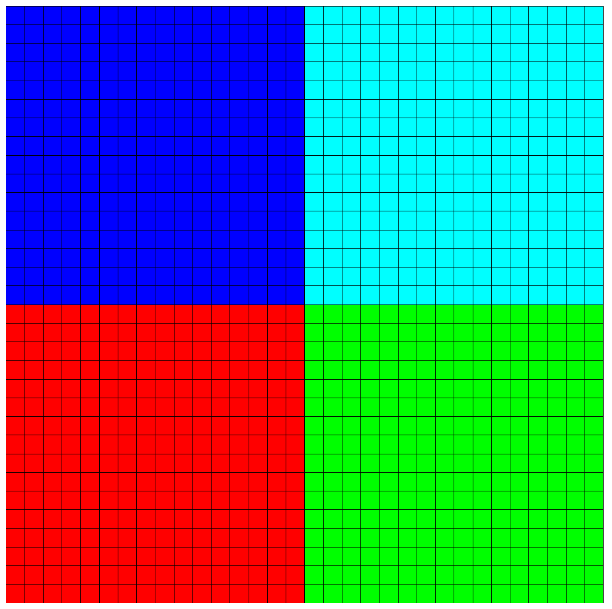

# Solve Poisson equation in parallel

This is same test case as `ex04a`. We solve it in parallel using `parallel::distributed::Triangulation` and PETSc. Diff the source files to see the differences.

```shell
code -n -d ../ex04a/demo.cc ./demo.cc
```

Compile and run

```shell
cmake .
make release
make
mpirun -np 4 ./demo
visit -o sol.pvd
```

You can see the mesh partitions in Visit by `Add -> Mesh -> mesh` and `Add -> Subset -> blocks` and then click `Draw`.

<p align="center">

</p>

You can time the program with different number of ranks

```shell
time mpirun -np 1 ./demo
time mpirun -np 4 ./demo
```

While the code is running, use the `top` command to see that multiple instances of `demo` are running.
