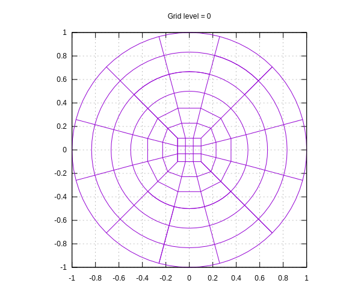
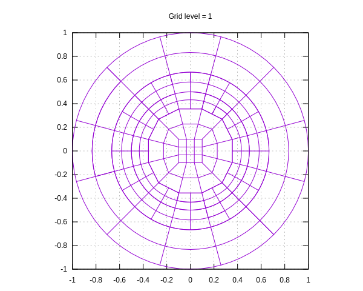
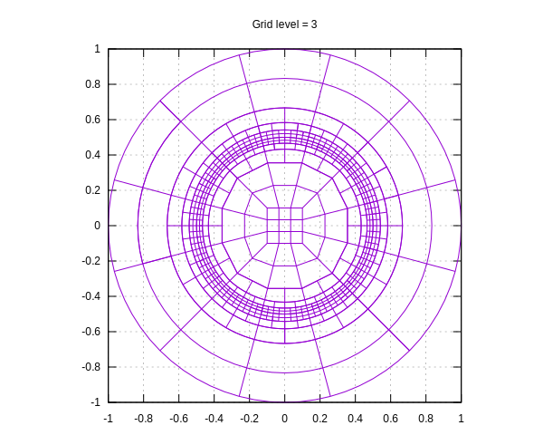

# 2-D Poisson equation with discontinuous coefficient

This is based on step-6 from the deal.II tutorials but modified to use grid made in gmsh. We use curved elements to better represent the discontinuity. The changes are in

* run: Reads gmsh grid and attaches SphericalManifold
* output_results: enable curved vtk output (use Paraview)
* Use MappingQGeneric(3) for assembly and error estimation

```shell
cmake .
make release && make
gmsh -2 ../grids/circ_disc_nice.geo -o circ_disc_nice.msh
./step-6
```

Visualize the grids

```shell
gnuplot plot_grid.gnu
```

The first few grids are shown below.

<p align="center">




</p>