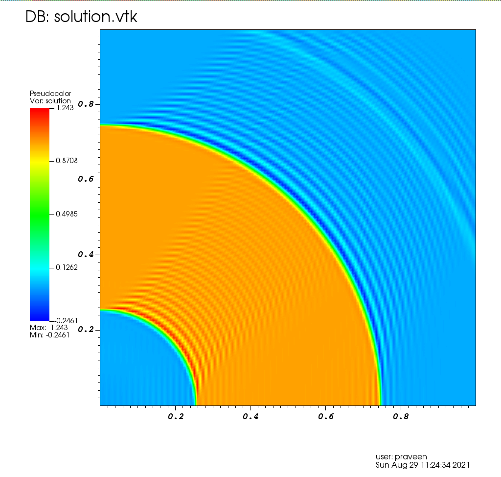

# Linear advection equation using Galerkin method

We solve

```
  beta . grad(u) = 0   in   (0,1) x (0,1)
              u  = 0   on   {y = 1}
              u  = g   on   {x = 0}
```

where

```
  beta = (y, -x)
```

and

```
  g(y) = 1  if  |y - 0.5| < 0.25
       = 0  otherwise
```

A sample solution is shown below

<p align="center">

</p