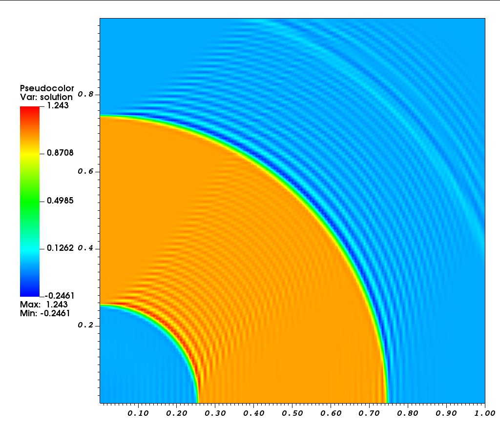
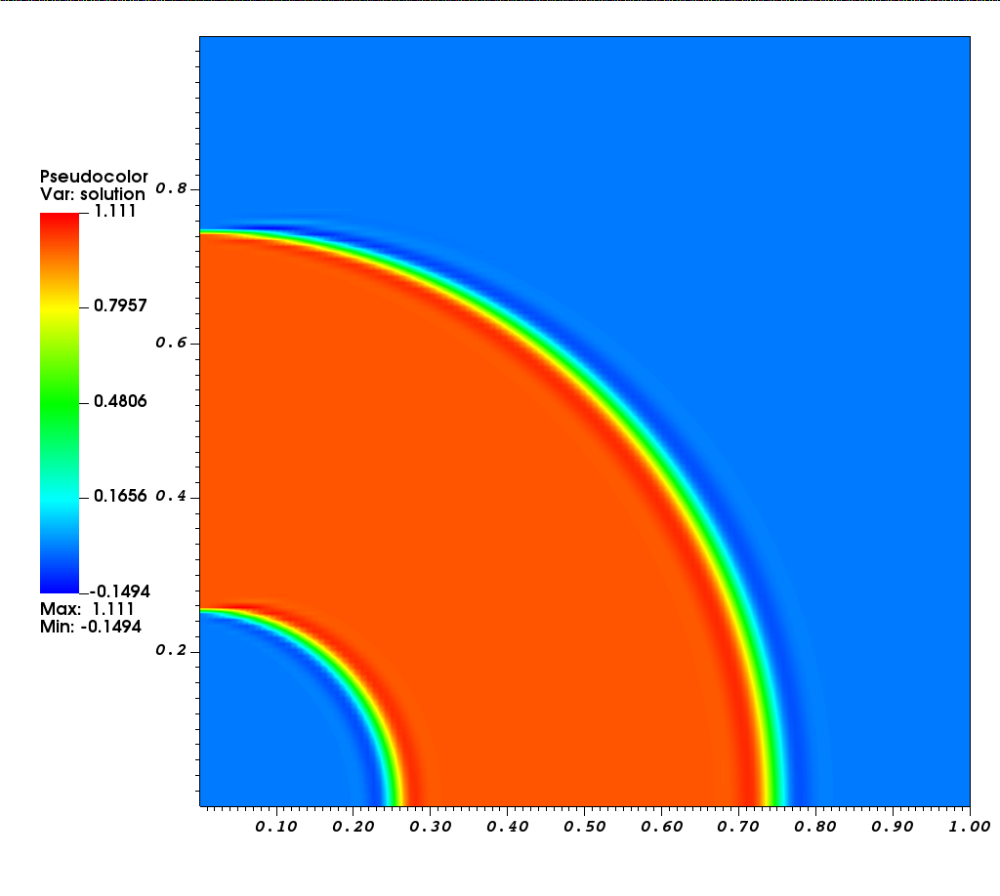

# Linear advection equation using Galerkin and SUPG method

We solve

```text
  beta . grad(u) = 0   in   (0,1) x (0,1)
              u  = 0   on   {y = 1}
              u  = g   on   {x = 0}
```

where

```text
  beta = (y, -x)
```

and

```text
  g(y) = 1  if  |y - 0.5| < 0.25
       = 0  otherwise
```

## Run the code

```shell
cmake .
make release
make
./demo
```

We first solve with Galerkin method and then with SUPG.

## Using Galerkin method

A sample solution is shown below

<p align="center">

</p>

## Using SUPG method

A sample solution is shown below

<p align="center">

</p>

See the [step-9](https://www.dealii.org/developer/doxygen/deal.II/step_9.html) tutorial in deal.II for another example of SUPG.