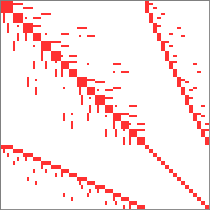
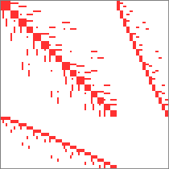

# Sparsity pattern for H(div)-L2 method

Grid with 4x4 elements and degree=1.

## Full coupling

The lower-right block has block-diagonal form since it is made of DG elements.

## No coupling in lower-right block (Schur system)

