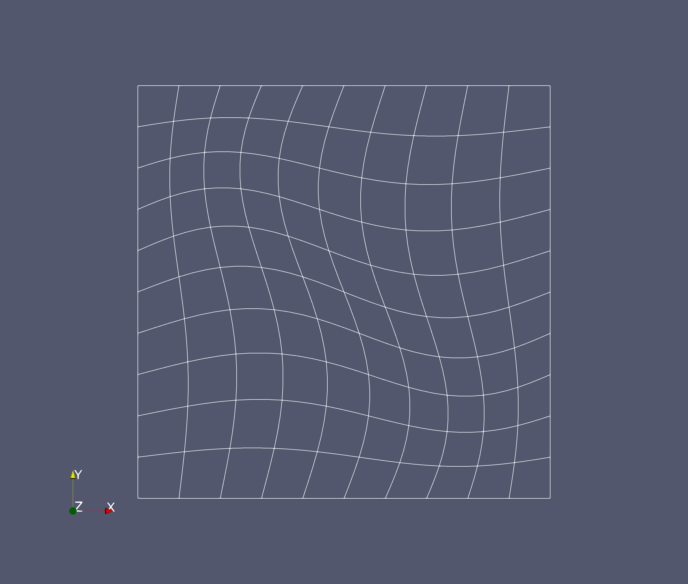

# Example of MappingFEField

We make a Cartesian grid in unit square and transform it to get a curved grid. The transformation is used to define a `MappingFEField`.

After running the code, open the file `grid.vtu` file in paraview and plot the mesh.

```shell
paraview grid.vtu
```

which should look like this


