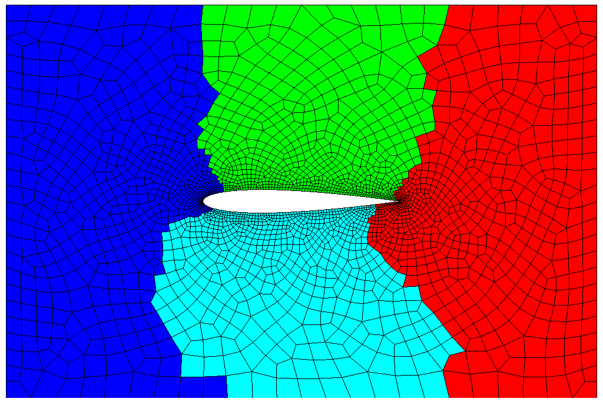

# Parallel fully distributed triangulation using gmsh

Shows how to create a p::f::t triangulation.

```shell
cmake .
make release
make
gmsh -2 ../../../grids/naca_in_rectangle.geo -o grid.msh
mpirun -np 4 ./demo
visit -o grid_000.pvtu
```

Figure shows 4 partitions obtained with Metis

<p align="center">

</p>

Also see the `log_#.txt` files.
