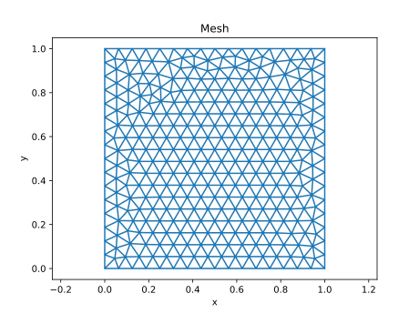

# 2D Poisson equation using linear FEM on triangles

You need [Gmsh](http://www.gmsh.info) and [meshio](https://github.com/nschloe/meshio) to run this problem.

## Generate the mesh

```bash
gmsh -2 mesh_tri.geo
```

The code `mesh_tri.py` shows how to plot the mesh and some function defined on this mesh. Run it like this

```bash
python mesh_tri.py
```

and you should see the mesh which looks like this

<p align="center">

</p>

The code also shows how to make use of mesh object and how to draw contour plots on a triangular grid.

## Solve the Poisson equation

```bash
python poisson2d.py
```

The computed solution is shown below

<p align="center">

</p>
