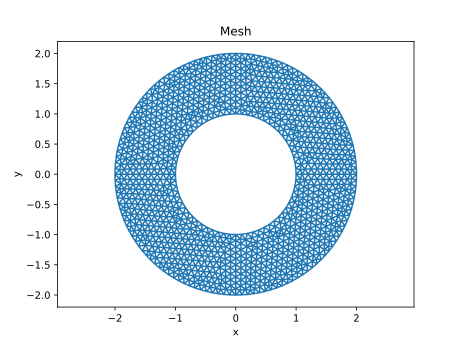
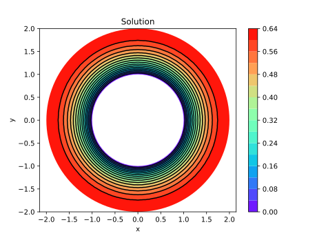
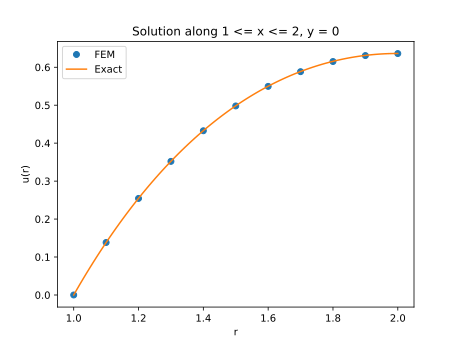

# Mixed boundary condition

Solve

```
   -Laplace(u)  = 1,   {1 < r < 2}
            u   = 0,   {r = 1}
          du/dn = 0,   {r = 2}
```

Generate mesh

```
$ gmsh -2 annulus.geo
```

See mesh and boundary

```
$ python mesh_tri.py
```

<p align="center">

</p>

Solve the problem

```
$ python poisson2d.py
```

<p align="center">


</p>
